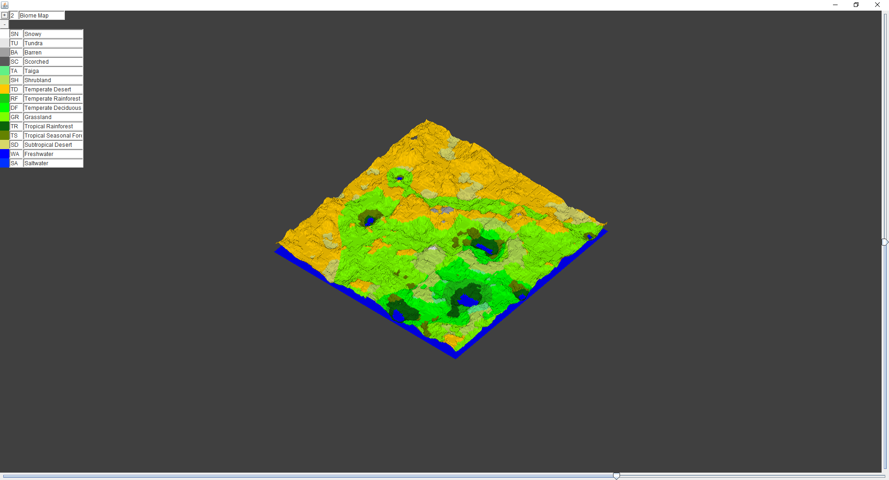
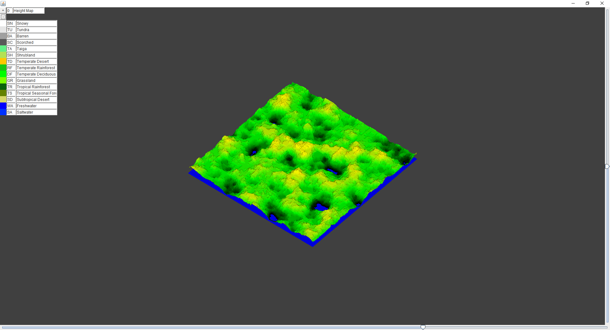
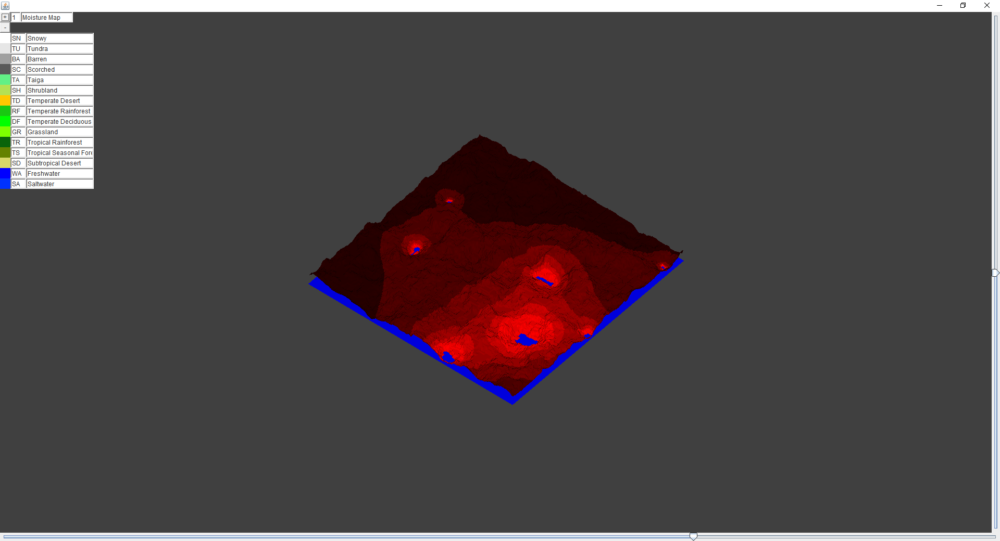

# TerrainGenerator
A seeded terrain generator that supports interfacing with noise generation algorithms and 2D filtering algorithms to generate a 2D map, visualized in AWT. 
I could have used a little more understanding of object-oriented programming and good programming practices in general when I made this program, so it can be unorganized and very hard to understand in places. This map generator was intended for use in a game and because of that there are a few unfinished parts that are unused, but the map generation algorithms themselves are completely finished.

Currently, the `MapGenerator` class includes a continuous perlin noise algorithm, a normal perlin noise algorithm, an octave combined noise algorithm, a 2D image smoothing algorithm, and various other simple algorithms for altering the map. They all can be used by extending the abstract class `HeightMapAlgorithm` or `NoiseGenerator`. 

# Example images:

Biomes 

Heightmap 

Moisture 

